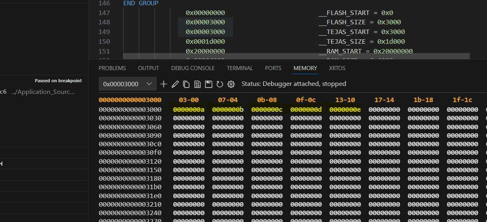
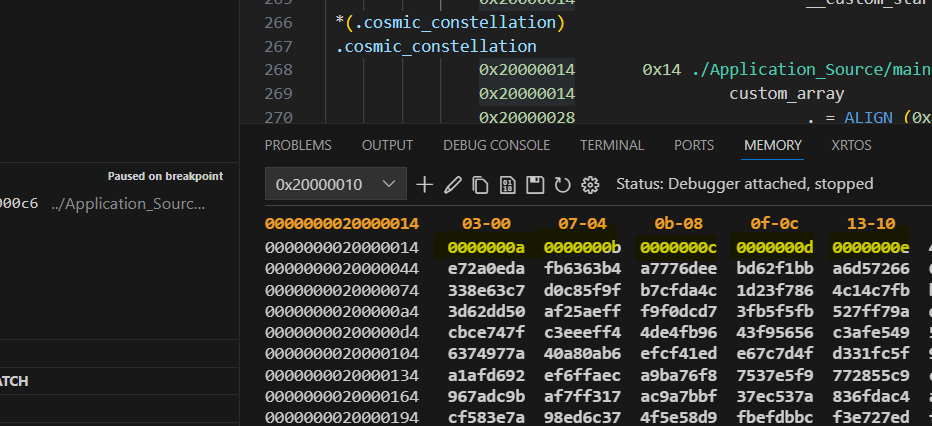
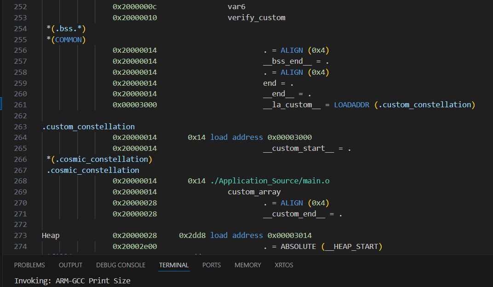
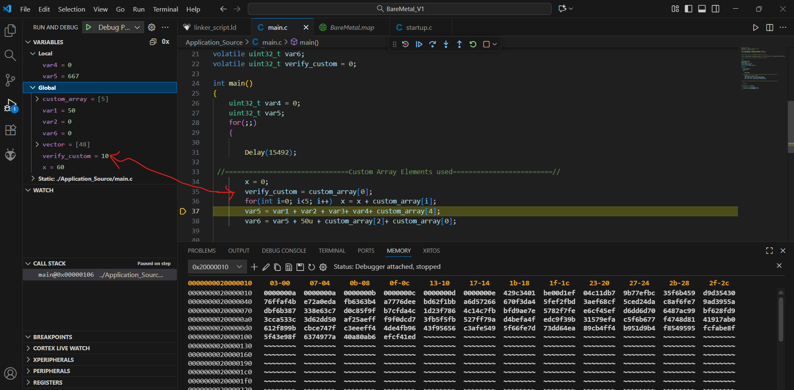

# 🛰️ Cosmic Constellation Section Relocation

**Author:** Tejas B G  
**Course:** Embedded Systems Design – Cohort 3  
**Organization:** Infineon Technologies  
**Target MCU:** PSoC4000S Plus  
**Toolchain:** arm-none-eabi-gcc  

---

## 🚀 Overview

This project demonstrates the **creation and relocation of a custom data section**  
named `.cosmic_constellation`. The section is:

- **Stored in Flash** initially (Load Memory Address, LMA = `0x00003000`)  
- **Relocated to SRAM** during system startup (Virtual Memory Address, VMA = after `.bss`)  

At runtime, the relocated data is accessed and verified via a global variable inside `main()`.

---

## 🧩 Project Structure

| File | Description | Links |
|------|--------------|-------|
| `main.c` | Defines `custom_array[5]` in `.cosmic_constellation` and uses it at runtime | [main.c](./main.c) |
| `startup.c` | Contains `Reset_Handler()` which copies `.cosmic_constellation` from Flash → RAM | [startup.c](./startup.c) |
| `linker_script.ld` | Defines custom section placement and linker symbols | [linker_script.ld](./linker_script.ld) |
| `BareMetal.map` | Shows proof of LMA (Flash) and VMA (RAM) | [BareMetal.map](./BareMetal.map) |

---

## 🧠 Concept Summary

Embedded systems with Harvard architectures store **code & constants in Flash**  
and **mutable data in RAM**.  

This project implements:
- Dual-placement of a section using the `AT>` directive in the linker script.
- Explicit runtime relocation inside `Reset_Handler`.
- Verification of correct data transfer using debugger memory inspection.

---

## ⚙️ Memory Placement Summary

| Section | Type | Storage | Runtime Location | Description |
|----------|------|----------|------------------|-------------|
| `.text` | Code | Flash | Flash | Executable instructions |
| `.data` | Initialized global data | Flash | SRAM | Copied by startup |
| `.bss` | Uninitialized data | N/A | SRAM | Zeroed at startup |
| `.rodata` | Constants | Flash | Flash | Read-only data |
| `.cosmic_constellation` | Custom | Flash (0x00003000) | SRAM (after `.bss` @ 0x20000014) | Relocated custom array |

---

## 🔭 Linker Symbol Roles

| Symbol | Description | Defined In |
|---------|--------------|-------------|
| `__la_custom__` | Load address (Flash @ 0x00003000) | Linker script |
| `__custom_start__` | Start of section in SRAM (VMA) | Linker script |
| `__custom_end__` | End of section in SRAM | Linker script |

These symbols are declared `extern` in `startup.c` and used for relocation during system startup.

---

## 🧮 Relocation Mechanism (in `Reset_Handler`)

```c
extern uint32_t __custom_start__; //custom start address
extern uint32_t __custom_end__;   //custom section end in vma
extern uint32_t __la_custom__;    // custom section addr in flash

size = &__custom_end__ - &__custom_start__;
pDst = (uint32_t*)&__custom_start__;     
pSrc = (uint32_t*)&__la_custom__;

for(uint32_t i = 0; i < size; i++)
{
    *pDst++ = *pSrc++;
}
```

## 🧾 Dual-Placement in Linker Script

```ld
__FLASH_START = 0x00000000;
__FLASH_SIZE =  0x00003000;
__TEJAS_START = 0x00003000;
__TEJAS_SIZE = 0x00020000 - 0x00003000;

__la_custom__ = LOADADDR(.custom_constellation); /* load address (LMA) */

MEMORY
{
  FLASH (rx)  : ORIGIN = __FLASH_START, LENGTH = __FLASH_SIZE
  RAM   (rwx) : ORIGIN = __RAM_START,   LENGTH = __RAM_SIZE
  TEJAS (rx)  : ORIGIN = __TEJAS_START, LENGTH = __TEJAS_SIZE /* Custom flash region start address */
}

SECTIONS
{
  .custom_constellation :
  {
      __custom_start__ = .;
      KEEP(*(.cosmic_constellation))
      . = ALIGN(4);
      __custom_end__ = .;
  } > RAM AT> TEJAS
}

```

## 🧪 Expected Runtime Output (in Debugger)

| Memory | Address Range | Expected Content | Notes |
|---------|----------------|------------------|-------|
| **Flash (LMA)** | `0x00003000` – `0x00003014` | `0x0A 0x0B 0x0C 0x0D 0x0E` | Original `.cosmic_constellation` data stored in Flash |
| **RAM (VMA)** | `0x20000014` – `0x20000028` | Same sequence copied by startup | Confirms relocation from Flash to RAM |
| **Variable `verify_custom`** | Watch Window | `0x0000000A` | Confirms relocated data in `.cosmic_constellation` is accessible at runtime |

At runtime, `verify_custom` continually reads the first element of `custom_array`,  
confirming successful relocation of `.cosmic_constellation` from Flash (LMA) to RAM (VMA).

---

## 🧾 Verification in MAP File

```map
                0x00003000                        __la_custom__ = LOADADDR (.custom_constellation)

.custom_constellation
                0x20000014       0x14 load address 0x00003000
                0x20000014                        __custom_start__ = .
 *(.cosmic_constellation)
 .cosmic_constellation
                0x20000014       0x14 ./Application_Source/main.o
                0x20000014                custom_array
                0x20000028                        . = ALIGN (0x4)
                0x20000028                        __custom_end__ = .
```

## 🧰 Visual Proof (Screenshots)

<div align="center">
  
  <p><b>Flash Memory (Before Relocation)</b></p>
</div>
<br>

<div align="center">
  
  <p><b>RAM Memory (After Relocation)</b></p>
</div>
<br>

<div align="center">
  
  <p><b>Map File Highlight (LMA/VMA Proof)</b></p>
</div>
<br>

<div align="center">
  
  <p><b>Watch Window – verify_custom & custom_array Values</b></p>
</div>
<br>

---

## ⚠️ Implementation Notes & Caveats

- `ALIGN(4)` ensures 32-bit alignment for proper access.  
- `KEEP()` directive prevents linker from optimizing away `.cosmic_constellation`.  
- Custom Flash region `TEJAS` begins at `0x00003000`.  
- Verified in debugger: Flash-to-RAM copy successful and accessible in runtime.  
- No overlap or conflict between memory regions.  
- `volatile` ensures live variable visibility during debugging.  

---

## ✅ Summary

This implementation successfully:

- Defines and places a custom section in Flash.  
- Relocates it to RAM during startup using linker symbols.  
- Verifies relocation via debugger and variable inspection.  

**Result:** `.cosmic_constellation` section correctly relocates from Flash → RAM  
and is accessible during program execution.

---

🧠 *Developed & Verified by:*  
**Tejas B G**  
Electronics & Communication Engineering – DSATM  
Cohort 3 | Infineon Embedded Systems Design Course
## 🧰 Visual Proof (Screenshots)

<div align="center">
  
  <p><b>Flash Memory (Before Relocation)</b></p>
</div>
<br>

<div align="center">
  
  <p><b>RAM Memory (After Relocation)</b></p>
</div>
<br>

<div align="center">
  
  <p><b>Map File Highlight (LMA/VMA Proof)</b></p>
</div>
<br>

<div align="center">
  
  <p><b>Watch Window – verify_custom & custom_array Values</b></p>
</div>
<br>

---

## ⚠️ Implementation Notes & Caveats

- `ALIGN(4)` ensures 32-bit alignment for proper access.  
- `KEEP()` directive prevents linker from optimizing away `.cosmic_constellation`.  
- Custom Flash region `TEJAS` begins at `0x00003000`.  
- Verified in debugger: Flash-to-RAM copy successful and accessible in runtime.  
- No overlap or conflict between memory regions.  
- `volatile` ensures live variable visibility during debugging.  

---

## ✅ Summary
## 🧰 Visual Proof (Screenshots)

<div align="center">
  
  <p><b>Flash Memory (Before Relocation)</b></p>
</div>
<br>

<div align="center">
  
  <p><b>RAM Memory (After Relocation)</b></p>
</div>
<br>

<div align="center">
  
  <p><b>Map File Highlight (LMA/VMA Proof)</b></p>
</div>
<br>

<div align="center">
  
  <p><b>Watch Window – verify_custom & custom_array Values</b></p>
</div>
<br>

---

## ⚠️ Implementation Notes & Caveats

- `ALIGN(4)` ensures 32-bit alignment for proper access.  
- `KEEP()` directive prevents linker from optimizing away `.cosmic_constellation`.  
- Custom Flash region `TEJAS` begins at `0x00003000`.  
- Verified in debugger: Flash-to-RAM copy successful and accessible in runtime.  
- No overlap or conflict between memory regions.  
- `volatile` ensures live variable visibility during debugging.  

---

## ✅ Summary

This implementation successfully:

- Defines and places a custom section in Flash.  
- Relocates it to RAM during startup using linker symbols.  
- Verifies relocation via debugger and variable inspection.  

**Result:** `.cosmic_constellation` section correctly relocates from Flash → RAM  
and is accessible during program execution.

---

🧠 *Developed & Verified by:*  
**Tejas B G**  
Electronics & Communication Engineering – DSATM  
Cohort 3 | Infineon Embedded Systems Design Course
## 🧰 Visual Proof (Screenshots)

<div align="center">
  
  <p><b>Flash Memory (Before Relocation)</b></p>
</div>
<br>

<div align="center">
  
  <p><b>RAM Memory (After Relocation)</b></p>
</div>
<br>

<div align="center">
  
  <p><b>Map File Highlight (LMA/VMA Proof)</b></p>
</div>
<br>

<div align="center">
  
  <p><b>Watch Window – verify_custom & custom_array Values</b></p>
</div>
<br>

---

## ⚠️ Implementation Notes & Caveats

- `ALIGN(4)` ensures 32-bit alignment for proper access.  
- `KEEP()` directive prevents linker from optimizing away `.cosmic_constellation`.  
- Custom Flash region `TEJAS` begins at `0x00003000`.  
- Verified in debugger: Flash-to-RAM copy successful and accessible in runtime.  
- No overlap or conflict between memory regions.  
- `volatile` ensures live variable visibility during debugging.  

---

## ✅ Summary

This implementation successfully:

- Defines and places a custom section in Flash.  
- Relocates it to RAM during startup using linker symbols.  
- Verifies relocation via debugger and variable inspection.  

**Result:** `.cosmic_constellation` section correctly relocates from Flash → RAM  
and is accessible during program execution.

---

🧠 *Developed & Verified by:*  
**Tejas B G**  
Electronics & Communication Engineering – DSATM  
Cohort 3 | Infineon Embedded Systems Design Course
## 🧰 Visual Proof (Screenshots)

<div align="center">
  
  <p><b>Flash Memory (Before Relocation)</b></p>
</div>
<br>

<div align="center">
  
  <p><b>RAM Memory (After Relocation)</b></p>
</div>
<br>

<div align="center">
  
  <p><b>Map File Highlight (LMA/VMA Proof)</b></p>
</div>
<br>

<div align="center">
  
  <p><b>Watch Window – verify_custom & custom_array Values</b></p>
</div>
<br>

---

## ⚠️ Implementation Notes & Caveats

- `ALIGN(4)` ensures 32-bit alignment for proper access.  
- `KEEP()` directive prevents linker from optimizing away `.cosmic_constellation`.  
- Custom Flash region `TEJAS` begins at `0x00003000`.  
- Verified in debugger: Flash-to-RAM copy successful and accessible in runtime.  
- No overlap or conflict between memory regions.  
- `volatile` ensures live variable visibility during debugging.  

---

## ✅ Summary

This implementation successfully:

- Defines and places a custom section in Flash.  
- Relocates it to RAM during startup using linker symbols.  
- Verifies relocation via debugger and variable inspection.  

**Result:** `.cosmic_constellation` section correctly relocates from Flash → RAM  
and is accessible during program execution.

---

🧠 *Developed & Verified by:*  
**Tejas B G**  
Electronics & Communication Engineering – DSATM  
Cohort 3 | Infineon Embedded Systems Design Course
## 🧰 Visual Proof (Screenshots)

<div align="center">
  
  <p><b>Flash Memory (Before Relocation)</b></p>
</div>
<br>

<div align="center">
  
  <p><b>RAM Memory (After Relocation)</b></p>
</div>
<br>

<div align="center">
  
  <p><b>Map File Highlight (LMA/VMA Proof)</b></p>
</div>
<br>

<div align="center">
  
  <p><b>Watch Window – verify_custom & custom_array Values</b></p>
</div>
<br>

---

## ⚠️ Implementation Notes & Caveats

- `ALIGN(4)` ensures 32-bit alignment for proper access.  
- `KEEP()` directive prevents linker from optimizing away `.cosmic_constellation`.  
- Custom Flash region `TEJAS` begins at `0x00003000`.  
- Verified in debugger: Flash-to-RAM copy successful and accessible in runtime.  
- No overlap or conflict between memory regions.  
- `volatile` ensures live variable visibility during debugging.  

---

## ✅ Summary

This implementation successfully:

- Defines and places a custom section in Flash.  
- Relocates it to RAM during startup using linker symbols.  
- Verifies relocation via debugger and variable inspection.  

**Result:** `.cosmic_constellation` section correctly relocates from Flash → RAM  
and is accessible during program execution.

---

🧠 *Developed & Verified by:*  
**Tejas B G**  
Electronics & Communication Engineering – DSATM  
Cohort 3 | Infineon Embedded Systems Design Course
## 🧰 Visual Proof (Screenshots)

<div align="center">
  
  <p><b>Flash Memory (Before Relocation)</b></p>
</div>
<br>

<div align="center">
  
  <p><b>RAM Memory (After Relocation)</b></p>
</div>
<br>

<div align="center">
  
  <p><b>Map File Highlight (LMA/VMA Proof)</b></p>
</div>
<br>

<div align="center">
  
  <p><b>Watch Window – verify_custom & custom_array Values</b></p>
</div>
<br>

---

## ⚠️ Implementation Notes & Caveats

- `ALIGN(4)` ensures 32-bit alignment for proper access.  
- `KEEP()` directive prevents linker from optimizing away `.cosmic_constellation`.  
- Custom Flash region `TEJAS` begins at `0x00003000`.  
- Verified in debugger: Flash-to-RAM copy successful and accessible in runtime.  
- No overlap or conflict between memory regions.  
- `volatile` ensures live variable visibility during debugging.  

---

## ✅ Summary

This implementation successfully:

- Defines and places a custom section in Flash.  
- Relocates it to RAM during startup using linker symbols.  
- Verifies relocation via debugger and variable inspection.  

**Result:** `.cosmic_constellation` section correctly relocates from Flash → RAM  
and is accessible during program execution.

---

🧠 *Developed & Verified by:*  
**Tejas B G**  
Electronics & Communication Engineering – DSATM  
Cohort 3 | Infineon Embedded Systems Design Course
## 🧰 Visual Proof (Screenshots)

<div align="center">
  
  <p><b>Flash Memory (Before Relocation)</b></p>
</div>
<br>

<div align="center">
  
  <p><b>RAM Memory (After Relocation)</b></p>
</div>
<br>

<div align="center">
  
  <p><b>Map File Highlight (LMA/VMA Proof)</b></p>
</div>
<br>

<div align="center">
  
  <p><b>Watch Window – verify_custom & custom_array Values</b></p>
</div>
<br>

---

## ⚠️ Implementation Notes & Caveats

- `ALIGN(4)` ensures 32-bit alignment for proper access.  
- `KEEP()` directive prevents linker from optimizing away `.cosmic_constellation`.  
- Custom Flash region `TEJAS` begins at `0x00003000`.  
- Verified in debugger: Flash-to-RAM copy successful and accessible in runtime.  
- No overlap or conflict between memory regions.  
- `volatile` ensures live variable visibility during debugging.  

---

## ✅ Summary

This implementation successfully:

- Defines and places a custom section in Flash.  
- Relocates it to RAM during startup using linker symbols.  
- Verifies relocation via debugger and variable inspection.

---

